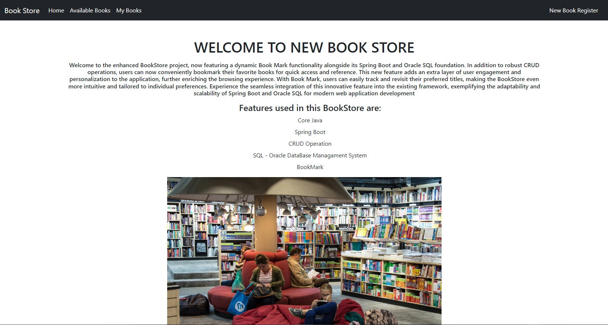

# BOOKSTORE USING SPRING BOOT

## CRUD OPERATIONS

-- Welcome to the enhanced BookStore project, now featuring a dynamic Book Mark functionality alongside its Spring Boot and Oracle SQL foundation.

- In addition to robust CRUD operations, users can now conveniently bookmark their favorite books for quick access and reference.
- This new feature adds an extra layer of user engagement and personalization to the application, further enriching the browsing experience.
- With Book Mark, users can easily track and revisit their preferred titles, making the BookStore even more intuitive and tailored to individual preferences.
- Experience the seamless integration of this innovative feature into the existing framework, exemplifying the adaptability and scalability of Spring Boot and Oracle SQL for modern web application development

## Feature in this Projects are:

-- Core Java
-- Spring Boot
-- CRUD Operation
-- SQL - Oracle DataBase Managament System
-- BookMark

## Result Images:

### BookStore - Home page

### BookStore - Available page

### BookStore - New Book Register Page

### BookStore - Edit Book Page

### BookStore - Favorite Bookmark page

